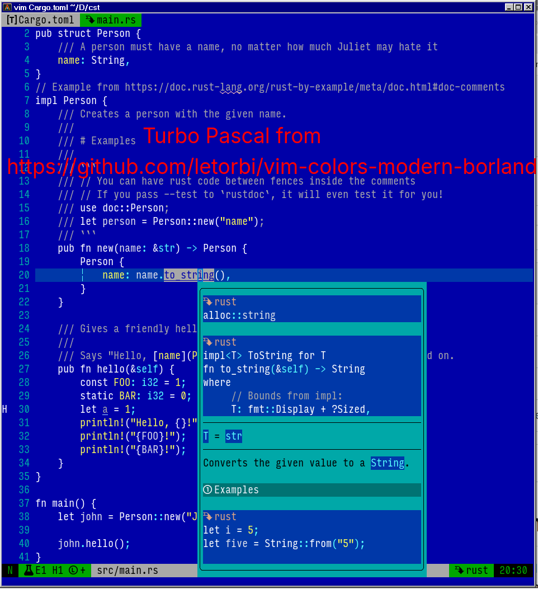

# 🛠️ My Neovim configuration

This repo contains my personal Neovim setup - designed to be fast, minimal, and powerful.

## 📦 Key Features & Plugins

* Plugin manager: lazy.nvim
* Plugins
  * "stevearc/conform.nvim"
  * "Fildo7525/pretty_hover"
  * "saghen/blink.cmp"
  * "mason-org/mason.nvim"
  * "mason-org/mason-lspconfig.nvim"
  * "neovim/nvim-lspconfig"
  * "mrcjkb/rustaceanvim"
  * "echasnovski/mini.nvim"
    * "mini.align"
    * "mini.basics"
    * "mini.clue"
    * "mini.comment"
    * "mini.cursorword"
    * "mini.diff"
    * "mini.extra"
    * "mini.files"
    * "mini.git"
    * "mini.hipatterns"
    * "mini.indentscope"
    * "mini.misc"
    * "mini.move"
    * "mini.notify"
    * "mini.pairs"
    * "mini.pick"
    * "mini.starter"
    * "mini.statusline"
    * "mini.tabline"
    * "mini.trailspace"
  * "nvim-telescope/telescope.nvim"
  * "saecki/crates.nvim"
  * "jellydn/hurl.nvim"
  * "towolf/vim-helm"
  * "f-person/git-blame.nvim"
  * "MeanderingProgrammer/render-markdown.nvim"
  * "iamcco/markdown-preview.nvim"
  * "stevearc/aerial.nvim"
  * "stevearc/stickybuf.nvim"
  * "folke/trouble.nvim"
  * "rachartier/tiny-inline-diagnostic.nvim"
  * "letorbi/vim-colors-modern-borland"
* Colorscheme: Inspired by editors and IDEs I've used throughout my career
(Turbo Pascal (learning how to program in pascal), TextPad (learning how to program in Java), Eclipse, and IntelliJ IDEA)

## 🧩 Structure

I went back to a single `init.lua` file:

* `init.lua`
* `colors/`
  * `tp.lua`
  * `ec.lua`
  * `ec36.lua`
  * `ij.lua`

## 📸 Screenshots

---

---

